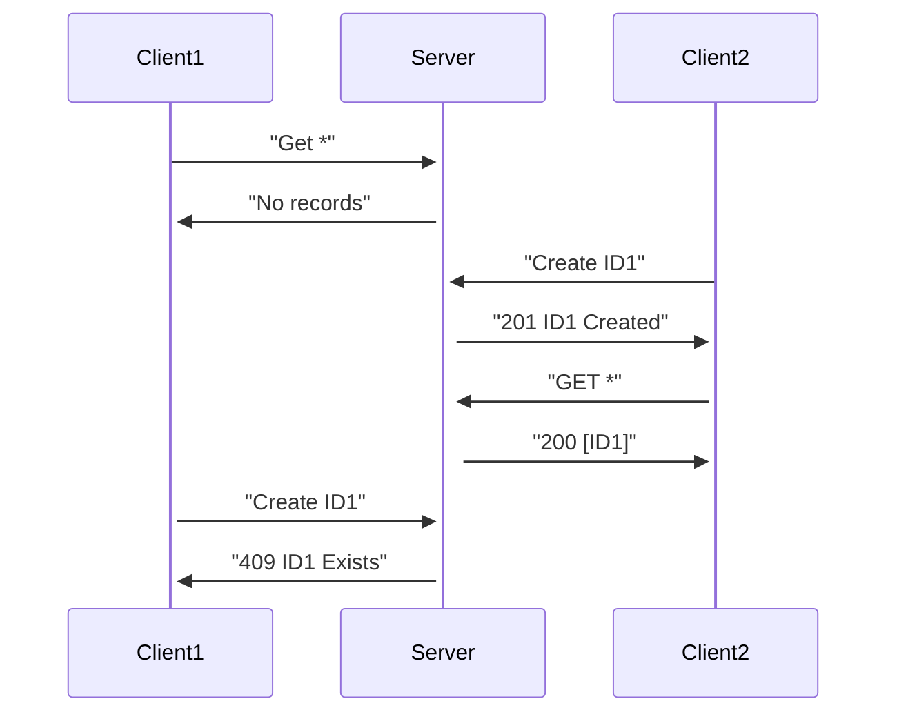

# Introducing the datasync server

The [Datasync Community Toolkit][1] is a set of open-source libraries for building client-server application where the application data is available offline.  Unlike, for example, [Google Firebase][2] or [AWS AppSync][3] (which are two competitors in this space), the [Datasync Community Toolkit][1] allows you to connect to any database, use any authentication, and provides robust authorization rules.  You can also run the service anywhere - on your local machine, in a container, or on any cloud provider.  Each side of the application (client and server) is implemented using .NET - [ASP.NET Core Web APIs][4] on the server side, and any .NET client technology (including [Avalonia][5], [MAUI][6], [Uno Platform][7], [WinUI3][8], and [WPF][9]) on the client side.

## What's the point of data synchronization?

With some applications, you don't get a choice.  If you are implementing a data gathering app where you expect data connectivity issues, data synchronization is a must have feature of the app.  However, you probably want to think about data synchronization as a feature in a wide variety of apps:

* **Resilience** - cellular networks are a shared resource.  IP addresses for connectivity change as you move and can drop completely in some areas.  If you want your data to be available while you move around, you have to build that in.  Data synchronization is one of the main techniques used to accomplish this goal.

* **Flexibility** - when you are using a data synchronization service, your data is stored within a local database.  You get a significant amount of flexibility in what you do to that database that you may not have when communicating with a server.  Updates are faster and you get a wider variety of search capabilities.

* **User experience** - the most important point of data synchronization is that your interactions with the user can be fulfilled faster than a round-trip to the server.  This benefits your users by making your application feel "snappier" because there is much much less latency involved.

Data synchronization is an overall benefit to your application, but it does come with some down sides.

* Identifiers must be globally unique.  It's normal for developers to say "an auto-incrementing integer ID is good enough" when setting up the database.  It isn't.  Take a case where you have two clients operating offline:



As you can see from this basic transaction, whoever creates the first record causes conflicts for everyone coming afterwards.  Fortunately, .NET has globally unique IDs built in.  For alternatives to the UUID, take a look at [ULIDs][10] and [Snowflake IDs][11] as alternatives.  Both of these globally unique IDs are well supported with .NET community libraries.

* **Optimistic Concurrency** allows a client to accept a valid change in a disconnected state.  It checks for conflicts when the change is sent to the server.  This feature requires that an agreed upon concurrency check happens at the server for each change.  The change may be rejected if the concurrency check fails.

* **Incremental synchronization** reduces the bandwidth consumed by synchronization events by only requesting and transmitting new, removed, or changed entities.Incremental synchronization means that each data set must be isolated from the other synchronized data sets - no foreign keys are allowed.  This ensures that one data set can be updated without affecting other data sets.

* **Soft delete** ensures that deletions from the data set can be propagated to all clients and ensures data consistency.  It does this by including a "deleted" flag in the entity which is used to notify the client that the entity in question should no longer be considered.  This requires a clean-up process on the server to purge deleted records at a later date.

The net effect of these key features is that entities (or data transfer objects - DTOs) need to follow a specific pattern for implementation:

* **Id** - a globally unique string.
* **UpdatedAt** - a date/time with millisecond resolution to allow for isolated changes.
* **Version** - an opaque string that holds the concurrency token.
* **Deleted** - the soft deleted flag to indicate that an entity is deleted.

Underneath, the server is a standard ASP.NET Core Web API following RESTful techniques. Semantics included in [RFC9110][12] - specifically sections 8 and 13 - provide optimistic concurrency.  An [OData][20] based query structure allows for filtering, ordering, and paging.  By using an ASP.NET Core Web API, we get the following benefits:

* Test the API using [Postman][13], [Insomnia][14], or [Thunder Client][15] (among others).
* Generate a [Swagger][16] or [OpenApi][17] definition, allowing easy integration into API management solutions.
* It integrates with standard [OAuth 2.0][18] and [OIDC][19] type identity solutions for both authentication and authorization.
* Write your own client.  The same service can be used for web, SPA, and mobile - even if it's not .NET based.  You don't have to use a specific client library.
* See the data using [Wireshark][21], [Charles][22], or other proxy technologies for debugging.

## Your first datasync service

There is a [dotnet template][23] for getting started with your first server.  However, it's worth delving into how to create a datasync service from scratch.

### It starts with a Web API project

Yes, you can do this all in Visual Studio.  Create a solution, then create a C# Web API project.  I like starting my projects from the command line:

```bash
mkdir datasync-sample
cd datasync-sample
dotnet new sln -n datasync-sample
dotnet new gitignore
dotnet new webapi -n Sample.WebAPI
dotnet sln ./datasync-sample.sln add ./Sample.WebAPI/Sample.WebAPI.csproj
```

As with any other ASP.NET Core application, use whatever you want to edit the files (I'm using [Visual Studio Code][24] with the [C# Dev Kit][25]) and run the application through your editor or on the command line.

### Web API + Entity Framework Core

Start by cleaning up the project.  Remove the model, http file, and controller or minimal API.  You need a blank canvas from which to work.

Add some NuGet packages to get started.  This project is going to be based on [SQL Server][26].  The [LocalDb][27] version of SQL Server is installed alongside Visual Studio, but you can also install it separately.  However, you can also use [MySql][28], [PostgreSQL][29], [MongoDB][30], [LiteDB][31], [Sqlite][32], or any other database that is supported by [Entity Framework Core][33].

!!! tip Use Aspire for easy development
    [.NET Aspire][34] is an easy way to configure, run, and debug a database combined with ASP.NET Core code.  On the development system, it runs inside Docker Desktop.  When deployed to the cloud, it uses container infrastructure such as Azure Container Apps.

```bash
cd Sample.WebAPI
dotnet add package Microsoft.EntityFrameworkCore.SqlServer
dotnet add package Microsoft.EntityFrameworkCore.Tools
dotnet add package CommunityToolkit.Datasync.Server
dotnet add package CommunityToolkit.Datasync.Server.EntityFrameworkCore
```

Next, let's set up a database.  For this, I'll need a model:

```csharp
using CommunityToolkit.Datasync.Server.EntityFrameworkCore;
using System.ComponentModel.DataAnnotations;

namespace Sample.WebAPI;

public class TodoItem : EntityTableData
{
    [Required, MinLength(1)]
    public string Title { get; set; } = string.Empty;

    public bool IsComplete { get; set; }
}
```

All datasync models must implement the `ITableData` interface, which defines the entity metadata (`Id`, `UpdatedAt`, `Version`, and `Deleted`) required for datasync operations.  Each repository provides a repository-specific implementation of `ITableData`.  The entities stored in the repository must inherit from this repository-specific implementation.  For Entity Framework Core, there are four implementations:

* `EntityTableData` is used whenever the server can control `UpdatedAt` and `Version`.
* `CosmosEntityTableData` is used specifically for Cosmos DB.
* `SqliteEntityTableData` is used specifically for Sqlite.
* `RepositoryControlledEntityTableData` is used when the server cannot control `UpdatedAt` and `Version` - the repository controls them instead.

The [database tests][35] include a set of sample contexts and entity classes so you can see (for example) how to set up PostgreSQL or your favorite database.

Next, let's create a `DbContext`:

```csharp
using Microsoft.EntityFrameworkCore;

namespace Sample.WebAPI;

public class AppDbContext(DbContextOptions<AppDbContext> options) : DbContext(options)
{
    public DbSet<TodoItem> TodoItems => Set<TodoItem>();
}
```

You should also deal with creating and updating the database.  This can be done with:

* A database initializer that is called when the service starts.
* [Entity Framework Core migrations][36].
* A [Data-tier application][37] project.

You can also use your own scripts for this. I use a database initializer that calls `EnsureCreatedAsync()` in most of my projects to ensure that a blank database is populated.  This allows you to use migrations or a DACPAC project in production for keeping the schema of the database in sync with your code. 

Next, let's wire the database into our app:

```csharp
using CommunityToolkit.Datasync.Server;
using Microsoft.EntityFrameworkCore;
using Sample.WebAPI;

WebApplicationBuilder builder = WebApplication.CreateBuilder(args);

string connectionString = builder.Configuration.GetConnectionString("DefaultConnection")
    ?? throw new ApplicationException("DefaultConnection is not set");

builder.Services.AddDbContext<AppDbContext>(options => options.UseSqlServer(connectionString));
builder.Services.AddDatasyncServices();
builder.Services.AddControllers();

WebApplication app = builder.Build();

// TODO: Initialize the database

app.UseHttpsRedirection();
app.UseAuthorization();
app.MapControllers();

app.Run();
```

This looks just like a regular web API project - because it is. The only extra service is `Services.AddDatasyncServices()`, which is for the Datasync Community Toolkit.

!!! info OData EdmModel
    The datasync protocol uses OData for bulk transfers and query capabilities, implemented by the [Microsoft.AspNetCore.OData][38] package.  The `IServicesCollection.AddDatasyncServices()` method adds all the services required to support OData.

Add a `DefaultConnection` to the ConnectionStrings section in `appsettings.Development.json`.  This defines where the database "lives".  To use LocalDb (a local edition of the Microsoft SQL Server), include the following:

```json
{
  "ConnectionStrings": {
    "DefaultConnection": "Server=(localdb)\\mssqllocaldb;Database=TodoApp;Trusted_Connection=True"
  }
}
```

### Add a table controller

Datasync services are provided through [REST API controllers][39].  Because OData requires a controller infrastructure, you cannot use minimal APIs, FastEndpoints, or other libraries to implement the endpoints.  Each entity that you expose for datasync operations requires a table controller within the project. Here is the most basic table controller:

```csharp
using CommunityToolkit.Datasync.Server;
using CommunityToolkit.Datasync.Server.EntityFrameworkCore;
using Microsoft.AspNetCore.Mvc;
using Sample.WebAPI;

namespace Sample.WebAPI.Controllers;

[Route("tables/[controller]")]
public class TodoItemController : TableController<TodoItem>
{
    public TodoItemController(AppDbContext context) 
        : base(new EntityTableRepository<TodoItem>(context))
    {
    }
}
```

There are a lot of options you can use to modify the behavior.  Here is a more expansive version of the same controller that implements most of the options available:

```csharp
using CommunityToolkit.Datasync.Server;
using CommunityToolkit.Datasync.Server.EntityFrameworkCore;
using Microsoft.AspNetCore.Mvc;
using Sample.WebAPI;

namespace Sample.WebAPI.Controllers;

[Route("tables/[controller]")]
public class TodoItemController : TableController<TodoItem>
{
    public TodoItemController(AppDbContext context, ILogger<TodoItemController> logger) : base() 
        : base(new EntityTableRepository<TodoItem>(context))
    {
      Repository = new EntityTableRepository<TodoItem>(context);
      Logger = logger;
      Options = new TableControllerOptions 
      {
        EnableSoftDelete = false,
        MaxTop = 128000,
        PageSize = 100,
        UnauthorizedStatusCode = 401
      };
    }
}
```

All the values in the options are the defaults.   Let's take a look at what each one means:

**EnableSoftDelete** affects what happens when the requesting application suggests deleting an entity.  If soft-delete is enabled, the entities `Deleted` flag will be set to true and that entity will not be considered unless deleted items are explicitly requested (which is a part of the synchronization process).

**MaxTop** affects how many records can be requested in one go.  It's the maximum value of the `$top` parameter in query operations.

**PageSize** is the maximum number of records that will be returned in one response.  The server implements paging.  If there are more records to be returned, the response from the server indicates the query parameters to use to get the next page of results.

**UnauthorizedStatusCode** affects what response is generated if the user is not authorized to read or write a record.  See [a later tutorial](./part-4.md).

To add further table controllers, you should:

* Create the model (based on the same `EntityTableData`).
* Add the model to the `AppDbContext`.
* Create a table controller based on `TableController<TEntity>` with a unique route.

## Generate an OpenApi document

[OpenApi][17] (the proper name for what used to be called [Swagger][16]) and the associated [SwaggerUI][42] web interface are important test tools.  Used together, they allow you to view and use the REST endpoints directly from your web app.  The Datasync Community Toolkit supports [Swashbuckle][40] and [NSwag][41] - the two most popular OpenApi libraries.  I'm going to use [Swashbuckle][40] for this project. Start by adding the right packages:

```bash
dotnet add package CommunityToolkit.Datasync.Server.Swashbuckle
```

This will also bring in the core Swashbuckle packages as transitive dependencies.  Next, update your `Program.cs`:

```csharp
// Where you set up your services:
builder.Services
  .AddEndpointsApiExplorer()
  .AddSwaggerGen(options => options.AddDatasyncControllers());

// Right after the .UseHttpsRedirection() call
app.UseSwagger().UseSwaggerUI();
```

Recompile and run your application. Use your browser to open the `/swagger` endpoint.  You'll see a nice UI for interacting with the REST interface.  Check out the definitions of the models and the endpoints you can access.

## How to interact with the server

Each table controller handles five operations:

* **`POST /tables/items`** creates an entity in the repository.  The data annotations for the entity will be checked (and your client will receive a _400 Bad Request_ if the data annotations check fails).  You do not (and should not) specify the metadata (`UpdatedAt`, `Version`, and `Deleted`).  You may specify an Id property for your entity, but you don't have to.  If you don't specify an Id property, one will be created for you.  The call will return the entity as it was stored in the database.  You can go and check it in the database after the call.  If you do specify an Id property but it already exists, this will return a _409 Conflict_ response. The existing entity on the server will be included in the response.

* **`GET /tables/items/{id}`** returns a JSON representation of the entity.  This is the same thing returned by the POST or PUT operations as well.  If you have set up soft delete on the table controller and the entity is marked as deleted, you will see a _410 Gone_ response. You may also get a _404 Not Found_ response if the entity is not in the database. If you get a _410 Gone_ response, you can use:

* **`GET /tables/items/{id}?__includedeleted=true`** also returns a JSON representation of the entity.  However, unlike the prior version, this version will return the entity if the entity happens to be marked as deleted.

* **`DELETE /tables/items/{id}`** which deletes an entity (or marks the entity as deleted if you have configured the table controller to use soft-delete). Unlike the other entities, this version will not return a _404 Not Found_.  It will assume you are deleting it again and just say "yes, it no longer exists" - also known as _204 No Content in HTTP land.  This is the first of the operations where you can use [conditional logic][44] to ensure that the entity you are deleting has the same version as you expect (i.e. it has not changed since you downloaded it).  You do this with an ``If-Match header.  More on this in a bit.

* **`PUT /tables/items/{id}`** replaces an entity with new data.  Like `DELETE`, it supports [conditional headers][44].  Like `POST`, it returns the modified entity as stored in the database.  Like `GET`, you can specify that you should replace a deleted entity (in fact, this is how you "undelete" an entity after it has been marked for deletion).

* Finally, **`GET /tables/items`** gets the first page of items.  You can also use the following [OData query][43] parameters:

  * `$filter` specifies an OData filter, which is then translated into a LINQ query before being sent to the service.
  * `$select` specifies a list of properties that you want to return.
  * `$orderby` specifies the properties that you want to use for server-side sorting (including asc for ascending and desc for descending).
  * `$skip` tells the server to skip the first N matching entities.
  * `$top` tells the server to include the first N matching entities after the skip value.
  * `__includedeleted=true` tells the server to include entities that are marked for deletion.

The OData filtering, ordering, and paging query parameters give a lot of flexibility, but they are complex.  You would normally use the client package to do translations for you.

## Using conditional requests

Let's talk a little about conditional headers.  Let's say you have an entity that looks like this:

```http
// Request
POST /tables/items HTTP/1.1
Content-Type: application/json

{
  "title": "This is a test",
  "isComplete": false
}

// Response
201 Created
Link: https://localhost:1234/tables/items/t1
Content-Type: application/json

{
  "id": "t1",
  "updatedAt": "2024-12-24T08:00:00.123Z",
  "version": "AAAAAABB==",
  "deleted": false,
  "title": "This is a test",
  "isComplete": false
}
```

This is typical of a POST transaction.  The property names are "camel-case" by default.  You don't know what is behind that version string (technically, it's a base-64 encoded byte array managed by the database, but treat it as "do not touch").  Now, I want to update this entity on the server but only if it has not been changed.  I can do this:

```http
// Request
PUT /tables/items/t1 HTTP/1.1
Content-Type: application/json
If-Match: "AAAAAABB=="

{
  "id": "t1",
  "updatedAt": "2024-12-24T08:00:00.123Z",
  "version": "AAAAAABB==",
  "deleted": false,
  "title": "This is an update",
  "isComplete": false
}

// Response
200 OK
Content-Type: application/json

{
  "id": "t1",
  "updatedAt": "2024-12-25T09:30:00.456Z",
  "version": "AAAAAABC==",
  "deleted": false,
  "title": "This is an update",
  "isComplete": false
}
```

!!! info Conditional Headers
    The conditional headers are defined by [section 13 of RFC 9110][44].

Note that you submit the SAME version (in a quoted string) as an `If-Match` header, and then you submit the new data (but with the same metadata) in the payload.  The updated entity is returned in the response and that has a new version and the new updatedAt timestamp.  If someone else had done a change, you might get the following:

```http
// Request
PUT /tables/items/t1 HTTP/1.1
Content-Type: application/json
If-Match: "AAAAAABB=="

{
  "id": "t1",
  "updatedAt": "2024-12-24T08:00:00.123Z",
  "version": "AAAAAABB==",
  "deleted": false,
  "title": "This is an update",
  "isComplete": false
}

// Response
412 Precondition Failed
Content-Type: application/json

{
  "id": "t1",
  "updatedAt": "2024-12-25T09:30:00.456Z",
  "version": "AAAAAABC==",
  "deleted": false,
  "title": "This is an update",
  "isComplete": false
}
```

In this case, the response has a failure code and the content of the response contains the server version.  This is not the same as your version - it's a conflict.  You now have the client side version and the server side version.  You can decide what to do:

* To accept the client-side version, copy the version from the server-side into your client-side entity, then re-submit with the updated `If-Match` header.
* To accept the server-side version, just overwrite your client version.
* To pick and choose data, construct your new entity version using the servr-side version and updatedAt values, then re-submit with the updated `If-Match` header.

You want to re-submit with the updated `If-Match` header in case the server-side has changed since you received the conflict message.  You can also "force" the change by omitting the `If-Match` header.

## Final thoughts

Obviously, I've just scratched the surface of the Datasync Community Toolkit here, but I've covered a lot of ground - how to create the server with a basic repository, how to set up OpenApi, and how to handle conflicts.

In the [next tutorial](./part-2.md), I'll cover the standard repositories that are distributed with the Datasync Community Toolkit.

## Further reading

* [The Datasync Community Toolkit](https://communitytoolkit.github.io/Datasync/)
* [RFC 9110 - HTTP Semantics](https://www.rfc-editor.org/rfc/rfc9110.html)
* [The OpenAPI Specification (Swagger)](https://swagger.io/resources/open-api/)

<!-- Links -->
[1]: https://github.com/CommunityToolkit/Datasync
[2]: https://firebase.google.com/
[3]: https://docs.aws.amazon.com/appsync/latest/devguide/what-is-appsync.html
[4]: https://learn.microsoft.com/training/modules/build-web-api-aspnet-core/
[5]: https://avaloniaui.net/
[6]: https://dotnet.microsoft.com/apps/maui
[7]: https://platform.uno/
[8]: https://learn.microsoft.com/windows/apps/winui/winui3/
[9]: https://wpf-tutorial.com/
[10]: https://github.com/ulid/spec
[11]: https://github.com/twitter-archive/snowflake/tree/b3f6a3c6ca8e1b6847baa6ff42bf72201e2c2231
[12]: https://www.rfc-editor.org/rfc/rfc9110.html
[13]: https://www.postman.com/
[14]: https://insomnia.rest/
[15]: https://www.thunderclient.com/
[16]: https://swagger.io/specification/v2/
[17]: https://swagger.io/specification/
[18]: https://auth0.com/intro-to-iam/what-is-oauth-2
[19]: https://openid.net/developers/how-connect-works/
[20]: https://www.odata.org/
[21]: https://www.wireshark.org/
[22]: https://www.charlesproxy.com/
[23]: https://www.nuget.org/packages/CommunityToolkit.Datasync.Server.Template.CSharp
[24]: https://code.visualstudio.com/
[25]: https://marketplace.visualstudio.com/items?itemName=ms-dotnettools.csdevkit
[26]: https://learn.microsoft.com/ef/core/providers/sql-server/
[27]: https://learn.microsoft.com/sql/database-engine/configure-windows/sql-server-express-localdb
[28]: https://dev.mysql.com/doc/connector-net/en/connector-net-entityframework-core.html
[29]: https://www.npgsql.org/efcore/?tabs=onconfiguring
[30]: https://www.mongodb.com/docs/entity-framework/current/?msockid=32dcd55c083f63043947c0de09e0620f
[31]: https://www.litedb.org/
[32]: https://learn.microsoft.com/ef/core/providers/sqlite/
[33]: https://learn.microsoft.com/ef/core/
[34]: https://learn.microsoft.com/dotnet/aspire/get-started/aspire-overview
[35]: https://github.com/CommunityToolkit/Datasync/tree/main/tests/CommunityToolkit.Datasync.TestCommon/Databases
[36]: https://learn.microsoft.com/ef/core/managing-schemas/migrations
[37]: https://learn.microsoft.com/sql/relational-databases/data-tier-applications/data-tier-applications
[38]: https://www.nuget.org/packages/Microsoft.AspNetCore.OData
[39]: https://learn.microsoft.com/aspnet/core/web-api/
[40]: https://learn.microsoft.com/aspnet/core/tutorials/getting-started-with-swashbuckle
[41]: https://learn.microsoft.com/aspnet/core/tutorials/getting-started-with-nswag
[42]: https://swagger.io/tools/swagger-ui/
[43]: https://learn.microsoft.com/odata/concepts/queryoptions-overview
[44]: https://www.rfc-editor.org/rfc/rfc9110.html#name-conditional-requests
