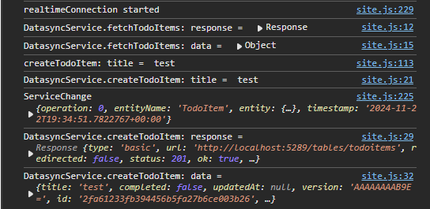

# Real-time updates

This article is the fifth in a series of articles about the [Datasync Community Toolkit][toolkit], which is a set of open source libraries for building client-server applications where the application data is available offline. By now, you should be comfortable with creating a backend service, but if you want to revisit any of the other tutorials:

* [Part 1](./part-1.md) covered basic service setup, OpenApi configuration, and basic table controllers.
* [Part 2](./part-2.md) covered the standard repositories.
* [Part 3](./part-3.md) covered custom repositories.
* [Part 4](./part-4.md) covered authorization and access control.

In this tutorial, I'm going to be implementing real-time notifications.  To show off a good sample and to make it easier to see multiple clients at once, I've added [a nice todo app][todoapp-start] that is based on [TodoMVC] to our sample set.

!!! info Details of the TodoMVC implementation
    * Start with an ASP.NET Core MVC application.
    * Add Entity Framework Core with your favorite database.
    * Integrate the Datasync Community Toolkit with the `TodoItem` model.
    * Add a [TodoMVC] JavaScript application using local storage for the store.
    * Create a `DatasyncService` inside the site Javascript that uses `fetch()` to call the table controller.

    Most of the code is in `wwwroot/js/site.js`.  You should be able to download the project, then press F5 to run the project.

## Implementing real-time notifications

One of the basic questions I get asked (a lot) is how you can go from a datasync service to a real-time datasync service.  Inevitably, the person asking is comparing the Datasync Community Toolkit with their experience with Firebase, Realm, or another "real time database". 

Firebase, Realm, and others can do what they do because they are in charge of every aspect of the database. The Datasync Community Toolkit starts with a premise that you are in charge of how things work, want to own the data, and use your own database. As a result, you need to write more code for some uncommon scenarios like real-time notifications.  You also get a lot of control over who is notified and when. 

There are things you CAN do to make it seem like you are using a real-time database. You need three things:

1. A real-time or near real-time communication channel between the server and the client.
2. A method of triggering an event that is transmitted on that communication channel.
3. A method of reacting to that event when it arrives at the client.

## Potential communication channels

There are a lot of options in the "potential communication channels" depending on your specific circumstances.

* You can use a web-based real-time communication channel such as [WebSockets] or [SignalR].  Azure has scalable infrastructure for these that can scale up to about a million concurrent connections.  However, these communication channels are expensive (both in cost and complexity) and more suited to smaller numbers of connections.
* You can use a two-way communication channel like [gRPC].  I've never used gRPC, but the two-way communication is how (for example) Firebase implements its real-time functionality.  It would be better if you implemented a gRPC channel for the entire system rather than just the real-time component.
* You can batch up the updates within a database, then use a long-polling HTTP request to get the updates.  This is highly scalable at the cost of more database tables to manage and more complexity on the service.
* You can use an out-of-band push-based communication channel like [APNS], [FCM], or [WNS].

For this project, I'm going to use [SignalR].  It's well supported by ASP.NET Core and scalable when combined with additional Azure services.  It also has the advantage that I don't need to sign up for additional services to check it out.  I can run everything on my local machine.

## Triggering an event from the datasync service

There are two ways of triggering an event on the datasync service:

1. You can use the `PostCommitHookAsync` on the access control provider.
2. You can hook into the `RepositoryUpdated` event on the table controller.

If you have decided that every single table controller will get its own access control provider, the `PostCommitHookAsync` within the access control provider is a great way to trigger the events.  If, however, you prefer better separation of concerns, the event handler will make more sense.  

## Reacting to events on the client

How you react to events on the client depends on the communication channel.  I'm going to be sending an event over the communication channel that looks like this:

```json
{
  "operation": "ADD",
  "entityName": "TodoItem",
  "entity": {
    "id": "1234",
    "createdAt": "2024-12-24T03:00:00.123Z",
    "updatedAt": "2024-12-24T03:00:00.123Z",
    "version": "AAAAAAAB=",
    "title": "Santa Claus is coming!",
    "completed": false
  }
}
```

This data structure is expandable. 

I'm going to create the SignalR channel with the `@microsoft/signalr` package, then wait for messages.  As each message is received, I'm going to add, delete, or update the data within my internal list depending on the contents of the message.

## Walking through the code

I'm using a [base project][todoapp-start] to start, and I introduced this earlier - it's got a TodoMVC front end and an ASP.NET Core backend with the Datasync Community Toolkit already integrated.  You can download and run the application from the [todoapp-start] repository and follow along.  I'll also show you how to do the trigger both ways (however, you should only use ONE way).

Let's start by integrating the SignalR hub (that's the ASP.NET Core bit) into this project.  You need to create a "hub" and then wire it into the HTTP pipeline.  My hub looks like this:

```csharp
using CommunityToolkit.Datasync.Server;
using Microsoft.AspNetCore.SignalR;
using System.Text.Json;

namespace TodoApp.Service.Controllers;

public class ServiceHub: Hub
{
}
```

This is the place where you would normally accept messages from the client.  In this case, all the communication is going from the server to the client, so I don't need to add any methods to the service hub.  It's just there to allow the client to register themselves to receive messages.

Next, update the `Program.cs` to add the newly created hub to the HTTP pipeline:

```csharp
var builder = WebApplication.CreateBuilder(args);

// Missing - all the other services that are set up.  Don't delete them.

builder.Services.AddControllersWithViews();
builder.Services.AddSignalR();

var app = builder.Build();

// Missing - the rest of the HTTP pipeline setup.  Don't delete it.

app.MapDefaultControllerRoute();
app.MapHub<ServiceHub>("/servicehub");

app.Run();
```

Obviously, I missed out the bulk of the code here, but it's still there. 

Next, let's adjust the client code so that it is receiving messages from the SignalR hub.  First, add the `@microsoft/signalr` npm package to the project.  You can either use **Add** > **Client-Side Library** to add it, or you can add the following snippet to the `libman.json` file:

```json
{
  "provider": "jsdelivr",
  "library": "@microsoft/signalr@6.0.6",
  "destination": "wwwroot/lib/microsoft/signalr/"
}
```

When you save the file, it will restore the package. Add the package to your HTML code.  This is in the `Views/Home/Index.cshtml` file:

```html
  <script src="~/lib/todomvc-common/base.min.js"></script>
  <script src="~/lib/jquery/dist/jquery.min.js"></script>
  <script src="~/lib/handlebars/dist/handlebars.min.js"></script>
  <script src="~/lib/director/build/director.min.js"></script>
  <script src="~/lib/microsoft/signalr/dist/browser/signalr.min.js"></script>
  <script src="~/js/site.js"></script>
```

Finally, add the code to `wwwroot/js/site.js` to activate and log the activity:

```javascript
  const realtimeConnection = new signalR.HubConnectionBuilder().withUrl("/servicehub").build();
  realtimeConnection.on("ServiceChange", (evt) => {
      console.debug("ServiceChange", evt);
  });

  realtimeConnection.start().then(() => {
      console.debug("realtimeConnection started");
  }).catch(err => {
      console.error(err.toString());
  });
```

I placed this code at the bottom of the `site.js` file, right under the initialization and initial synchronization with the datasync service. Run the application at this point.  Find the developer tools for your browser and look at the JavaScript console.  You should see that the SignalR connection is established and awaiting messages:


Next, let's look at sending some messages!

## Trigger an event via the access control provider

I introduced the `IAccessControlProvider` and access control [last time](./part-4.md).  At the time, I said "PostCommitHookAsync is for eventing" and left it at that.  So, let's take a look at a sample access control provider that implements eventing.  My code for the `TodoItemsController` now looks like this:

```csharp
[Route("tables/todoitems")]
public class TodoItemsController : TableController<TodoItem>
{
    public TodoItemsController(
        TodoContext context,
        IHubContext<ServiceHub> hubContext
        ) : base()
    {
        Repository = new EntityTableRepository<TodoItem>(context);
        AccessControlProvider = new EventingProvider<TodoItem>(hubContext);
    }
}


public class EventingProvider<T>(IHubContext<ServiceHub> hubContext) : AccessControlProvider<T>() 
  where T : EntityTableData
{
    public override async ValueTask PostCommitHookAsync(TableOperation operation, T entity, CancellationToken cancellationToken = default)
    {
        RepositoryUpdatedEventArgs eventArgs = new(operation, typeof(T).Name, entity);
        await hubContext.Clients.All.SendAsync("ServiceChange", eventArgs, cancellationToken);
    }
}
```

Remember to turn on verbose logging in your browser console and run the application.  Changes will now show up within the console:



Expand the JavaScript handler to handle the incoming stream of data.

```javascript
  const realtimeConnection = new signalR.HubConnectionBuilder().withUrl("/servicehub").build();
  realtimeConnection.on("ServiceChange", (evt) => {
    console.debug("ServiceChange", evt);
    const entity = evt.entity;
    let madeChanges = false;
    switch (evt.operation) {
      case 0:
        const addedIdx = todoItems.findIndex(item => item.id == entity.id);
        if (addedIdx < 0) {
          todoItems.push(entity);
        } else {
          todoItems[addedIdx] = entity;
        }
        madeChange = true;
        break;
      case 1:
        todoItems = todoItems.filter(item => item.id !== todoItem.id);
        madeChanges = true;
        break;
      case 4:
        const modifiedIdx = todoItems.findIndex(item => item.id == entity.id);
        if (modifiedIdx >= 0) {
          todoItems[modifiedIdx] = entity;
          madeChanges = true;
        }
        break;
    }
    if (madeChanges) {
        renderTodoItems();
    }
  });
```

There are some things to note:

1. The "entity" is as stored in the database.  If you need to adjust it (for example, to remove some data), do it before you call `SendAsync()`.
2. The hub uses the default web `JsonSerializerOptions` for serializing the payload - in this case, `eventArgs`.  This is not the same serializer as the datasync service uses. See the [SignalR documentation](https://learn.microsoft.com/aspnet/core/signalr/configuration) for information on configuring the `JsonSerializerOptions` for the SignalR hub.
3. Because the hub uses the default web serializer options, the "operation" is a number:
  * 0 = create
  * 1 = delete
  * 2 = query (which isn't used)
  * 3 = read (which also isn't used)
  * 4 = update
4. The real-time hub message arrives **BEFORE** the response to the server.  That means that you'll have to adjust both the UI handling methods and the real-time message handling methods to deal with situtions where the change has already been made.
   
Now, run the application and open two browser windows side by side.  It's best if you open up developer tools along the bottom for screen real-estate.  When you make changes to one of the browsers, those same changes are replicated on the other browser without a refresh.

## Trigger an event using eventing

The table controller also has [eventing](https://learn.microsoft.com/dotnet/csharp/programming-guide/events/) built in.  Every change is published to the `RepositoryUpdated` event handler.  This is a great way to hook in (for example) cross-site replication or to do other interesting things that you don't want to be doing in the main flow of the request. 

```csharp
[Route("tables/todoitems")]
public class TodoItemsController : TableController<TodoItem>
{
    public TodoItemsController(TodoContext context, IHubContext<ServiceHub> hubContext) : base()
    {
        Repository = new EntityTableRepository<TodoItem>(context);
        RepositoryUpdated += async (sender, eventArgs) => await hubContext.Clients.All.SendAsync("ServiceChange", eventArgs);
    }
}
```

The same caveats as before apply here - most notably that the event normally arrives before the response from the server.  You can do the same tests with the two browsers to see it in action.

I prefer using eventing most of the time.  The code is simpler and there is better separation of concerns.

## Final thoughts

Most of the time, real-time is really not required.  When it is required, it's usually for time-sensitive information.  Make sure you really need it before you implement real-time.  It has scaling, cost, and complexity considerations.

Here are some more ideas:

* Each client has an "ID" shared between client and server, so I can opt to send the message to all the users except the one that sent the request to the server.  
* I can also decide whether to send time sensitive messages via push notification or real-time connections based on whether the user is connected or not.

Finally, let's discuss security.  Most systems are not as wide open as this demonstration app.  You need to consider whether the information belongs to the user before sending it, which inevitably means keeping a mapping between user (and groups or roles) and the connection.

## Further reading

* [WebSockets]
* [SignalR]

<!-- Links -->
[toolkit]: https://github.com/CommunityToolkit/Datasync
[todoapp-start]: https://github.com/CommunityToolkit/Datasync/tree/main/samples/todoapp-mvc
[TodoMVC]: https://todomvc.com
[WebSockets]: https://learn.microsoft.com/dotnet/fundamentals/networking/websockets
[SignalR]: https://learn.microsoft.com/aspnet/core/tutorials/signalr
[gRPC]: https://learn.microsoft.com/aspnet/core/grpc/
[APNS]: https://en.wikipedia.org/wiki/Apple_Push_Notification_service
[FCM]: https://firebase.google.com/docs/cloud-messaging/
[WNS]: https://learn.microsoft.com/windows/apps/design/shell/tiles-and-notifications/windows-push-notification-services--wns--overview